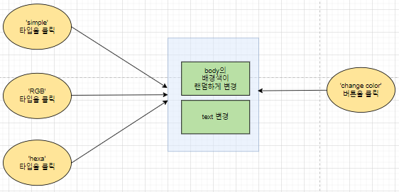
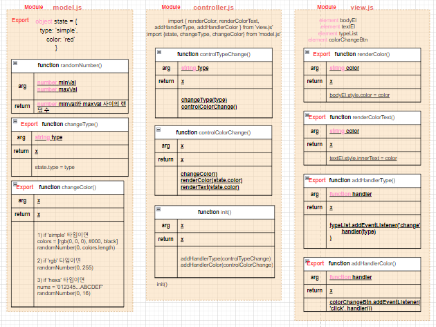
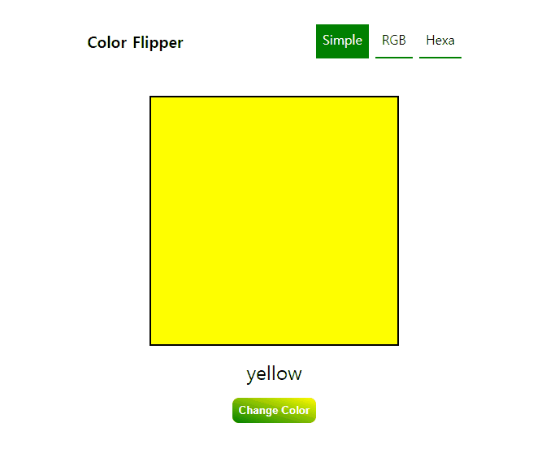

# ✔ Color Flipper 만들기

-   개요: 랜덤으로 배경색을 변경하는 프로젝트
-   주요 개념: arrays, `array.length`, `document.getElementById()`, `document.querySelector()`, `addEventListener()`, `document.body.style.backgroundColor`, `Math.floor()`, `Math.random()`

## 🎨 FlowChart & Architecture

### ▶ FlowChart

### ▶ Architecture

## 🧩 실습 결과물

### ▶ practice 1

> 튜토리얼 보기 전, 작성한 코드의 완성본

### ▶ practice 2

> 튜토리얼 본 후, 코드를 재작성한 결과 완성본

## 💡 후기

### ▶ practice 1 vs practice 2

> practice 1

> practice 2
