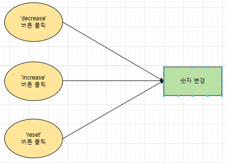
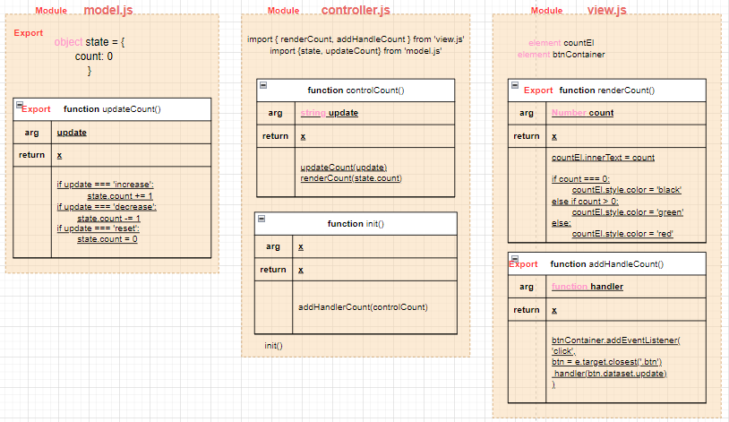
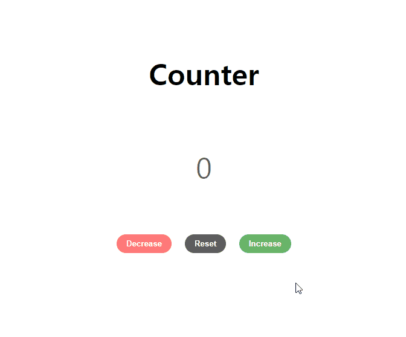

# ✔ Counter 만들기

-   개요: 숫자를 증가/감소/리셋하는 카운터를 만드는 프로젝트
-   주요 개념: `document.querySelectorAll()`, `forEach()`, `addEventListener()`, `currentTarget 속성`, `classList`, `textContent`

## 🎨 FlowChart & Architecture

### ▶ FlowChart

### ▶ Architecture

## 🧩 실습 결과물

### ▶ practice 1

> 튜토리얼 보기 전, 작성한 코드의 완성본

### ▶ practice 2

> 튜토리얼 본 후, 코드를 재작성한 결과 완성본

## 💡 후기

### ▶ practice 1 vs practice 2

> practice 1

> practice 2
