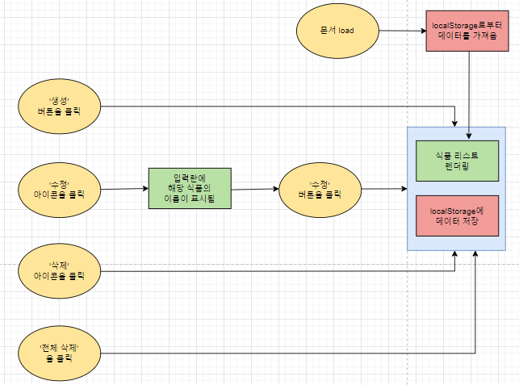
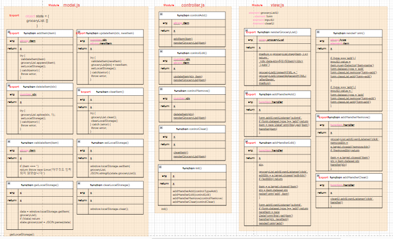
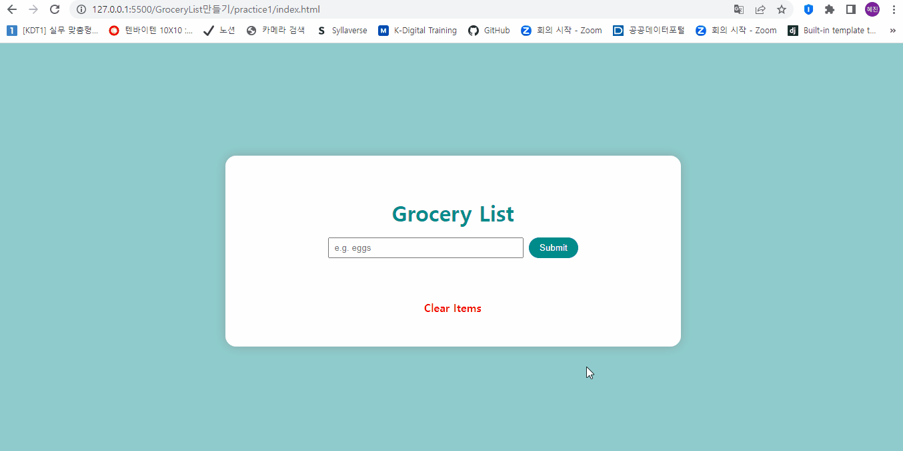

# ✔ Grocery List 만들기

-   개요: 장바구니 리스트에서 아이템을 추가하고 삭제할 수 있는 간단한 CRUD(Create, Read, Update, Delete) 앱을 만드는 프로젝트
-   주요 개념: `DOMContentLoaded`, `new Date()`, `createAttribute()`, `setAttribute()`, `appendChild()`, `filter()`, `map()`

## 🎨 FlowChart & Architecture

### ▶ FlowChart

### ▶ Architecture

## 🧩 실습 결과물

## 💡 후기

### ▶ 튜토리얼 vs 나의 코드

> 튜토리얼

-   global scope에 editFlag 변수를 두어 form이 submit될 때 아이템 추가인지 아이템 수정인지 파악했다
-   localStorage에 아이템을 저장할 때, 아이템 이름뿐만 아니라 생성한 시각을 id로 함께 넣어 저장했다
-   localStorage에 아이템을 저장/수정/삭제할 때마다, 기존의 localStorage에 저장된 모든 아이템들을 불러온 후 가공 처리해 다시 새로운 결과값을 저장해줬다

> 나의 코드

-   form 요소의 dataset에 add 또는 edit을 기록해두어 form이 submit될 때 아이템 추가인지 아이템 수정인지 파악했다
-   model.js 파일에도 현재 아이템들을 state 변수에 따로 저장해놓았기 때문에, localStorage에 아이템을 저장/수정/삭제할 때마다 기존의 localStorage에 저장된 모든 아이템들을 불러올 필요없이 바로 state 변수 안에 있는 아이템들을 가지고와 저장해줬다
