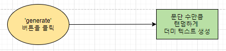
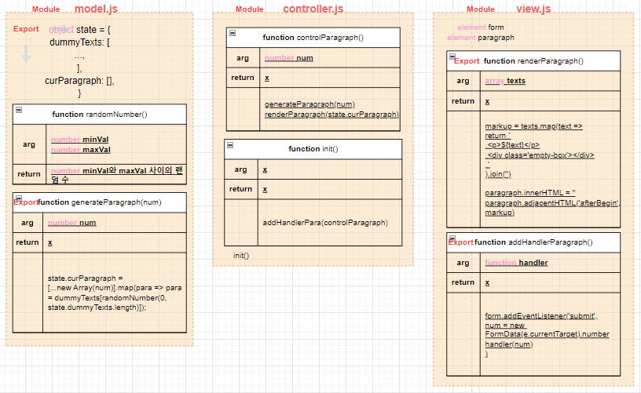
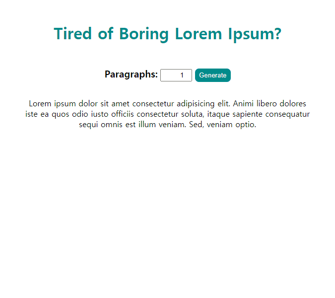

# ✔ Lorem Ipsum 만들기

-   개요: 나만의 Lorem Ipsum (더미 텍스트) 만들기
-   주요 개념: `parseInt()`, `Math.floor()`, `Math.random()`, `isNaN()`, `slice 메서드`, `event.preventDefault()`

## 🎨 FlowChart & Architecture

### ▶ FlowChart

### ▶ Architecture

## 🧩 실습 결과물

## 💡 후기

### ▶ 튜토리얼 vs 나의 코드

> 튜토리얼

-   input 값이 숫자가 아닐 때, 0 미만일 때, 10 이상일 때를 따로 처리해주었다
-   input 값이 valid하지 않은 경우에만, 랜덤으로 하나의 텍스트를 보여주었다

> 나의 코드

-   input 값을 따로 validation 해주지 않았다
-   입력한 숫자만큼 랜덤하게 텍스트 문단을 보여주었다
