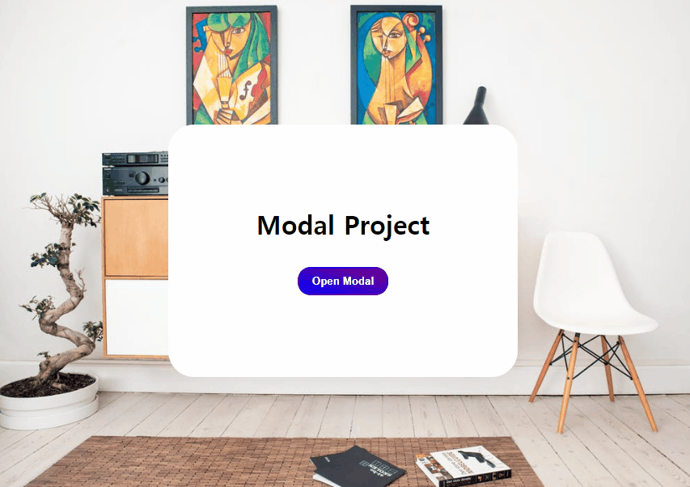

# ✔ Modal 만들기

-   개요: 모달창을 띄우는 프로젝트
-   주요 개념: `document.querySelector()`, `addEventListener()`, `classList.add()`, `classList.remove()`

## 🧩 실습 결과물

## 💡 후기

### ▶ 튜토리얼 vs 나의 코드

> 튜토리얼

-   모달 버튼을 클릭하면 'open-modal' 클래스를 추가해주고, 닫기 버튼을 클릭하면 'open-modal' 클래스를 제거해주는 방식으로 구현했다

> 나의 코드

-   모달 버튼이나 닫기 버튼을 클릭할 때마다 'hidden' 클래스를 토글해주는 방식으로 구현했다
