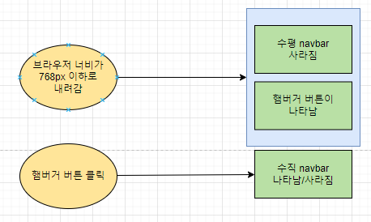
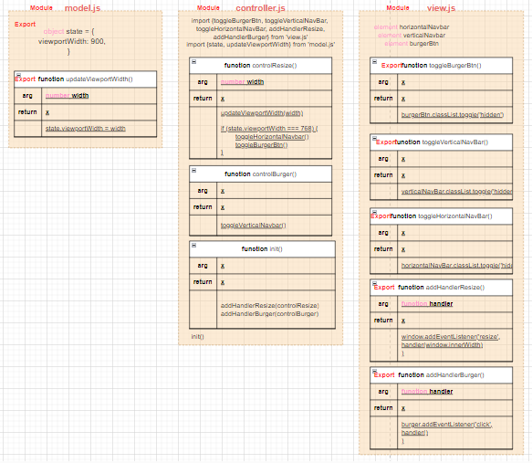
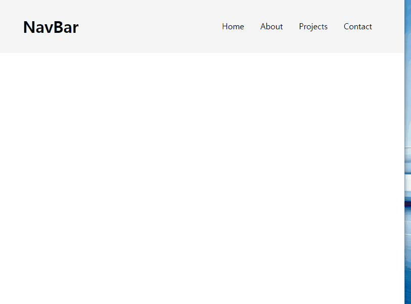

# ✔ Responsive Navbar 만들기

-   개요: viewport가 일정 기준 이하로 작아질 때, burger component가 생성되는 반응형 네비게이션바 만들기
-   주요 개념: `document.querySelector()`, `addEventListener()`, `classList.toggle()`

## 🎨 FlowChart & Architecture

### ▶ FlowChart

### ▶ Architecture

## 🧩 실습 결과물

## 💡 후기

### ▶ 튜토리얼 vs 나의 코드

> 튜토리얼

-   css를 사용해 viewport 너비에 따라 수평 navbar와 햄버거 버튼이 나타나고 사라지게 했다
-   html에서 수평 navbar와 수직 navbar를 따로 구분하지 않고, css를 사용해 조절했다
-   viewport 너비 800px 이하에서, links 클래스는 화면에 보이지 않게 하는 대신 show-links 클래스는 화면에 보이게 했다
-   따라서, viewport 너비 800px 이하에서 햄버거 버튼을 누를 때마다 show-links 클래스가 토글되게 함으로써 수직 navbar가 화면에 나타나고 사라지게 했다

> 나의 코드

-   js를 사용해 viewport 너비에 따라 수직 navbar와 햄버거 버튼이 나타나고 사라지게 했다
-   html에서 수평 navbar와 수직 navbar를 따로 구분하여 조절했다
-   window resize event listener를 사용해 viewport 너비 768px 이하일 때, 일일이 수평 navbar이 사라지고 햄버거 버튼이 나타나게 했다
-   튜토리얼처럼 viewport 너비에 따라 수평 navbar와 햄버거 버튼이 나타나고 사라지는 것은 js가 아닌 css에 맡기는 방식이 훨씬 더 깔끔한 코드가 될 것 같다
