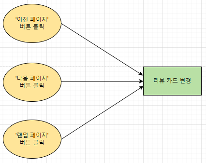
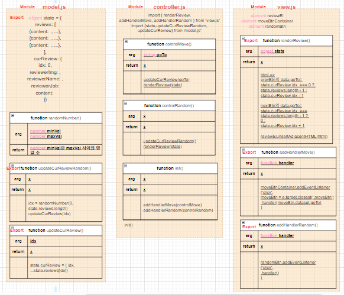
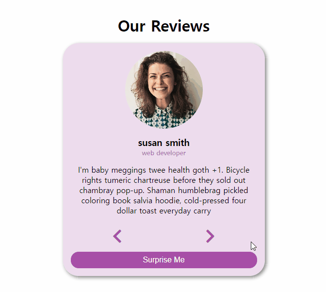

# ✔ Review Carousel 만들기

-   개요: 현재 리뷰 앞/뒤로 이동 가능하고, 랜덤하게 리뷰를 볼 수도 있는 캐러셀 만들기
-   주요 개념: objects, `DOMContentLoaded`, `addEventListener()`, `array.length`, `textContent`

## 🎨 FlowChart & Architecture

[](https://app.diagrams.net/?src=about#G18niF0ITBUZdSHKO5VxTGtSZLWk-ZsNd3)

### ▶ FlowChart



### ▶ Architecture



## 🧩 실습 결과물



## 💡 후기

### ▶ 실습 중 발생한 이슈 및 해결방법

> 이슈

prev button/next button/random button 중 하나를 한 번 클릭한 후, 아무리 다시 클릭을 해도 다른 리뷰로 변경되지 않는 문제가 발생했다.

> 원인

prev/next/random button 각각을 클릭하면, 결과적으로 renderReview() 함수가 실행되어 '.card' 내부의 모든 markup이 삭제되고 새로 생성된다.
반면, view.js 파일에서 btnContainer 변수는 페이지가 처음 로딩될 때 할당되어 renderReview() 함수가 실행되어 기존의 '.card\_\_btn-container' 요소가 변경되어도 이전의 값이 유지된 상태이다.
따라서, 과거의 '.card\_\_btn-container' 요소에 click event listener가 달려있기 때문에 새로 render된 이후의 '.card\_\_btn-container' 요소에는 event listener가 연결되어 있지 않아 event handler가 실행되지 않았던 것이다.

```js
// view.js
const btnContainer = document.querySelector(".card__btn-container");
const randomBtn = btnContainer.querySelector(".card__btn-random");

const renderReview = function (state) {
	const { idx, name, job, img, content } = state.curReview;
	const markup = `
  ...
  <div class="card__btn-container">
    <button class="card__btn-move card__btn-move--prev" data-go-to="${
		idx === 0 ? state.reviews.length - 1 : idx - 1
	}">
      <i class="fas fa-chevron-left"></i>
    </button>
    <button class="card__btn-move card__btn-move--next" data-go-to="${
		idx === state.reviews.length - 1 ? 0 : idx + 1
	}">
      <i class="fas fa-chevron-right"></i>
    </button>
    <button class="card__btn-random">Surprise Me</button>
  </div>
  `;

	card.innerText = "";
	card.insertAdjacentHTML("afterbegin", markup);
};

const addHandlerMove = function (handler) {
	btnContainer.addEventListener("click", function (e) {
		const moveBtn = e.target.closest(".card__btn-move");
		if (!moveBtn) return;

		const goTo = +moveBtn.dataset.goTo;
		handler(goTo);
	});
};

const addHandlerRandom = function (handler) {
	randomBtn.addEventListener("click", () => handler());
};
```

> 해결 방법

prev/next/random button 각각을 클릭했을 때, '.card' 내부의 모든 markup이 삭제되고 새로 생성되게 하는게 아니라 기존 markup과 새로운 markup 사이에 차이가 있는 text, attribute만 변경되게 했다.

```js
// view.js
const card = document.querySelector('.card');

const createMarkup = function (state) {
  const { idx, name, job, img, content } = state.curReview;

  return `
  <div class="card__review">
    
    <h3 class='card__name'>${name}</h3>
    <p class='card__job'>${job}</p>
    <p class='card__content'>${content}</p>
  </div>
  <div class="card__btn-container">
    <button class="card__btn-move card__btn-move--prev" data-go-to="${idx === 0 ? state.reviews.length - 1 : idx - 1}">
      <i class="fas fa-chevron-left"></i>
    </button>
    <button class="card__btn-move card__btn-move--next" data-go-to="${idx === state.reviews.length - 1 ? 0 : idx + 1}">
      <i class="fas fa-chevron-right"></i>
    </button>
    <button class="card__btn-random">Surprise Me</button>
  </div>
  `;
}

const renderReview = function (state) {
  const markup = createMarkup(state);

  card.innerText = '';
  card.insertAdjacentHTML("afterbegin", markup);
}

const updateReview = function (state) {
  const newMarkup = createMarkup(state);

  const newDOM = document.createRange().createContextualFragment(newMarkup);
  const newElements = Array.from(newDOM.querySelectorAll('*'));
  const curElements = Array.from(card.querySelectorAll('*'));

  newElements.forEach((newEl, i) => {
    const curEl = curElements[i];

    // Updates changed TEXT
    if (
      !newEl.isEqualNode(curEl) &&
      newEl.firstChild?.nodeValue.trim() !== ''
    ) {
      curEl.textContent = newEl.textContent;
    }

    // Updates changed ATTRIBUTES
    if (!newEl.isEqualNode(curEl))
      Array.from(newEl.attributes).forEach(attr =>
        curEl.setAttribute(attr.name, attr.value)
      );
  });
}

const addHandlerMove = function (handler) {
  const btnContainer = document.querySelector('.card__btn-container');
  ...
}

const addHandlerRandom = function (handler) {
  const randomBtn = document.querySelector('.card__btn-random');
  ...
}
```

### ▶ 튜토리얼 vs 나의 코드

> 튜토리얼

-   review 안에 들어갈 내용(img, author, job, info)에 해당하는 element를 모두 가지고 와 버튼을 누를 때마다 일일이 바꿔주었다
-   prev/next 버튼을 클릭하면 현재 아이템의 -1/+1 위치의 아이템을 렌더링하였다

> 나의 코드

-   현재 review DOM과 변경한 review DOM를 비교해 차이가 있는 부분만 렌더링해줬다
-   렌더링할 때 버튼 요소에 dataset으로 다음에 이동해야할 아이템의 인덱스를 미리 넣어준 후, prev/next 버튼을 클릭하면 dataset를 확인해 해당 아이템으로 렌더링해줬다
