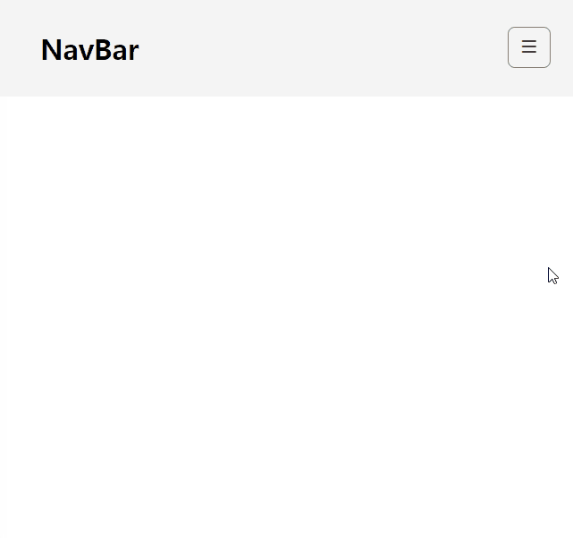

# ✔ Sidebar 만들기

-   개요: burger 버튼을 클릭하면 사이드바가 나타나게 하는 프로젝트
-   주요 개념: `document.querySelector()`, `addEventListener()`, `classList.toggle()`, `classList.remove()`

## 🧩 실습 결과물

### ▶ practice 1

> 튜토리얼 보기 전, 작성한 코드의 완성본

### ▶ practice 2

> 튜토리얼 본 후, 코드를 재작성한 결과 완성본

## 💡 후기

### ▶ practice 1 vs practice 2

> practice 1

> practice 2
