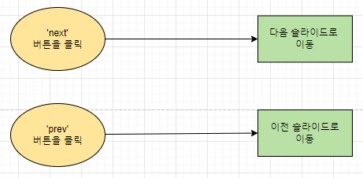
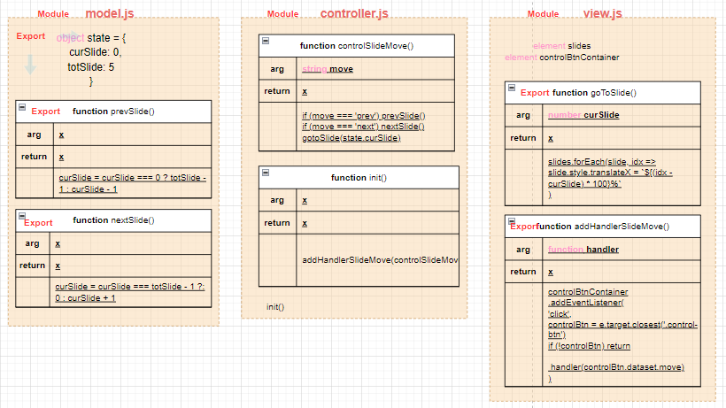

# ✔ Slider 만들기

-   개요: 이미지 슬라이더를 만드는 프로젝트
-   주요 개념: `document.querySelectorAll()`, `forEach()`, `addEventListener()`, `if/else statements`

## 🎨 FlowChart & Architecture

### ▶ FlowChart

### ▶ Architecture

## 🧩 실습 결과물

## 💡 후기

### ▶ 튜토리얼 vs 나의 코드

> 튜토리얼

-   js를 통해 각 slide를 처음에 `left: 0`, `left: 100%`, `left: 200%`, `left: 300%`으로 위치시켰다
-   prev/next 버튼을 클릭하면, 각 slide를 `translateX(-현재슬라이드 * 100)%` 만큼 이동시켰다

> 나의 코드

-   `width: slide 개수 * 100%` 크기인 slide-list로 slide를 한 겹 감싸 `display: flex`로 slide들을 좌우로 위치시켰다
-   prev/next 버튼을 클릭하면, slide-list를 `translateX(-현재슬라이드 * (100 / 전체슬라이드수)%)`만큼 이동시켰다
