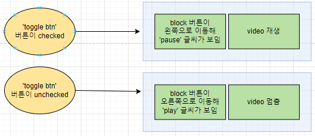
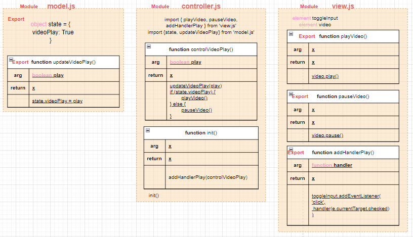

# ✔ Video 배경 만들기

-   개요: play, pause 기능을 이용해 영상 배경을 만드는 프로젝트
-   주요 개념: `document.querySelectorAll()`, `addEventListener()`, `classList.contains()`, `classList.add()`, `classList.remove()`, `play()`, `pause()`

## 🎨 FlowChart & Architecture

### ▶ FlowChart

### ▶ Architecture

## 🧩 실습 결과물

## 💡 후기

### ▶ 튜토리얼 vs 나의 코드

> 튜토리얼

-   기본 div/span 태그와 left 스타일링을 통해 스위치 버튼을 구현했다

> 나의 코드

-   radio 태그와 checked 여부에 따른 스타일링을 통해 스위치 버튼을 구현했다
